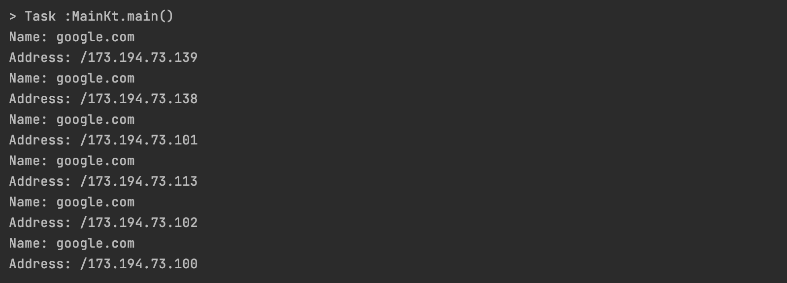
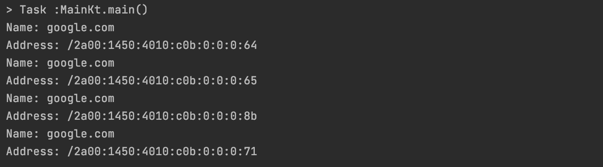

## Overview
Application that can query dns servers.
By default it uses UDP protocol, IPv4 query and Google dns server (8.8.8.8)

Supported query types:
 - A (IPv4)
 - AAAA (IPv6)  

TODO:
 - configuration from CLI (server, query type, protocol)
 - support more queries (CNAME, PTR)
 
## Output
  

